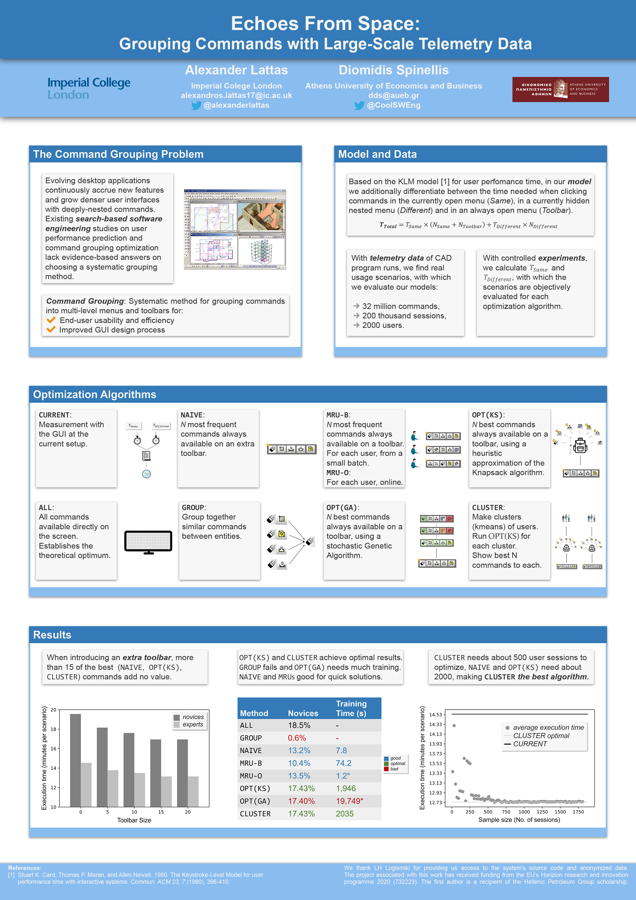

# Echoes From Space - Grouping Commands with Large Scale Telemetry Data
Published at ICSE 2018 at the Software Engineering in Practice track, in Gothenburg Sweden ([ACM Paper Link](https://dl.acm.org/doi/abs/10.1145/3183519.3183545))

[](https://www.spinellis.gr/pubs/conf/2018-ICSE-SEIP-cmd-optimize/html/cmd-optimize.pdf)

This repository contains the [source code](code/), [poster](doc/poster.jpg), and [presentation](doc/presentation.pdf) accompanying the paper.

[Alexandros Lattas](https://alexlattas.com)<sup>1</sup>,
[Diomedis Spinellis](https://www2.dmst.aueb.gr/dds/)<sup>2</sup>
<br/>
<sup>1</sup>Imperial College London,
<sup>2</sup>Athens University of Economics and Business
<br/>

## Source Code
The source code for all optimization algorithms used in paper can be found in the [notebook](code/cmd-optimze.ipynb):
```
code/cmd-optimize.ipynb
```
To pre-process anonymized telemetry such as the ones used in the experiments use:
```
python code/preprocess_data.py path/to/file.txt
```

## Summary
The purpose of this study is to create a simple User Interaction Model to evaluate alternative approaches to optimizing a user interface.

## Model
$T=M(S,T_C,T_M,C_A,C_G)$
Where $S$ is a command execution scenario expressed as a vector of commands, 
$T_C$ is the time required to switch between commands of the same group, 
$T_M$ is the time required to switch between commands of different groups, 
$C_A$ is a set of commands always available at the desktop, 
$C_G$ is a set of command groups, and T is the time required to execute.

All approaches can be expressed by varying $C_A$ and $C_G$.
A user's expertise level is expressed through $T_C$ and $T_M$.

## Calculating the Time Needed
In this simplified version of the User Interaction Model, we assert that only 2 weights are needed:

Same group: $T_s$ = _command1_ to _command2_
Different group: $T_d$ = _command1_ change-group _command2_

## Approaches to be evaluated
- **ALL** Put all commands on the screen (actually possible with new extra wide LCD screens). This establishes the theoretical optimum.
- **NAIVE** Naive: make the most frequently executed commands always available.
- **GROUP** Group heuristics: group together the most used common commands (e.g. delete and move) by doing away the class-verb method for selecting them.
- **MRU-B** User optimized, based on the most recently used (MRU) commands of a particular user executes more frequently during a training period (batch).
- **MRU-O** User optimized, based on the most recently used (MRU) commands of a particular user executes more frequently during continuously adjusted (online).
- **OPT** Optimized: run a (stochastic) optimization algorithm to select those commands whose combination yields the fastest user interaction time. This differs from NAIVE in that it takes into account the actual switching between entities.
- **CLUSTER** Clustered, based on 2-3 clusters of users. The clustering is performed based on the commands they execute. A stochastic optimization similar to OPT is ran to select the commands executed in each cluster.

## Data Format
The file format is: 
`init_time`, 
`click-on-group_name/click-on-command_group-name_command-name`. For example:

```
1497807650.013000 en_objects
1497807651.223000 vm_object_add
1497807655.943000 vm_object_get_attributes
```

The data used in these experiments are proprietary and are not made public in this repository.

## Poster Overview


